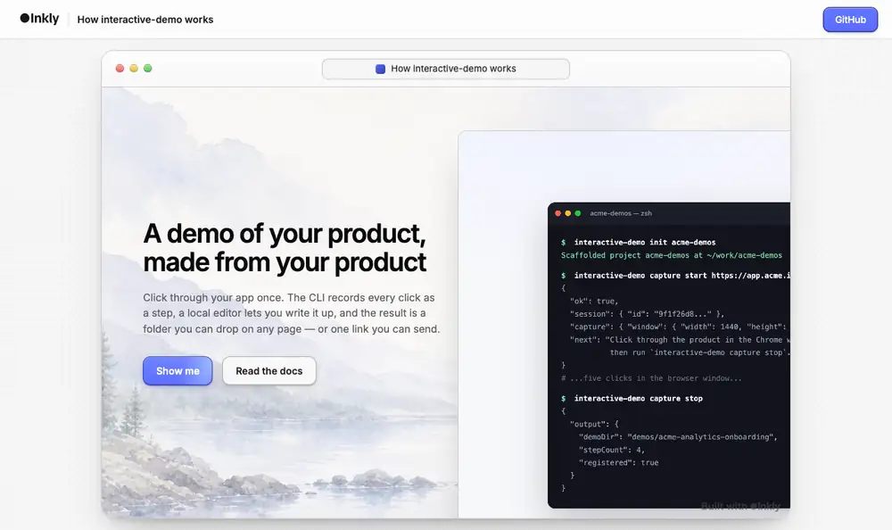
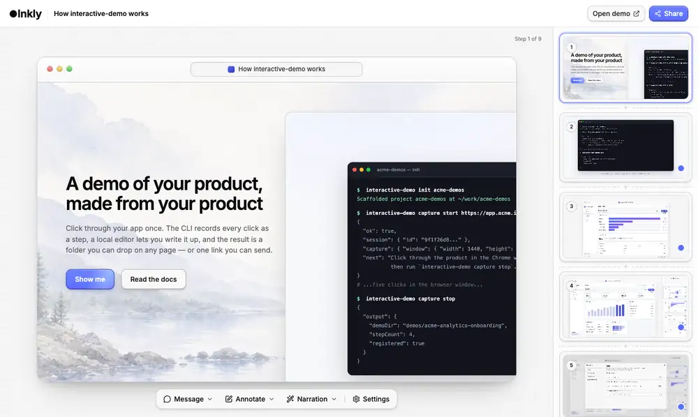

<h1 align="center">interactive-demo</h1>

<p align="center">
  <strong>Turn a click-through of your product into an interactive demo.</strong><br>
  Record it from the real app, write it up in a local editor, ship it as a link or a folder.
</p>

<p align="center">
  <a href="https://github.com/inkly-ai/interactive-demo/actions/workflows/ci.yml"></a>
  <a href="LICENSE"></a>
  
</p>



<p align="center"><em>Every screen above is a real screenshot of this tool, captured by this tool.<br>
It lives in <a href="examples/self-demo">examples/self-demo</a> and is re-shot by <code>node testbed/shoot.mjs</code>.</em></p>

## What you get

Screenshots or short clips of your real product, with hotspots and captions on
top, playing as a click-through a viewer drives themselves.

- **One command to a link.** `publish` puts the demo online and prints its URL.
  Publishing again updates the same link, so embeds keep working.
- **Or host it yourself.** `build` writes a self-contained folder that runs on
  any static host. Nothing in it phones home, and the embed snippets are
  identical either way — only the origin differs.
- **A React component too.** `<Demo>` and `<DemoModal>`, if your site is React.
- **Capture from the live app.** Click through your product in Chrome; every
  click becomes a step, with the pointer where you clicked. Scroll or type
  before a click and that step is recorded as a short video instead.

## Quickstart

```sh
npx @inkly-org/interactive-demo-cli init my-demos
cd my-demos && npm install
```

**Record your product** (needs Google Chrome — see [requirements](#requirements)):

```sh
npx interactive-demo capture start https://app.example.com --name "Onboarding"
# click through the product in the window that opens
npx interactive-demo capture stop
```

**Write it up.** Capture gives you structure, not writing — the captions are
the demo:

```sh
npm run dev     # preview on :3000, editor at /__demo/editor/
```

**Ship it:**

```sh
npx interactive-demo login && npx interactive-demo publish
```

That is the whole hosting step. Nothing to deploy, nothing to configure.

## The editor

`dev` serves a browser editor that writes straight back to the demo's files in
your repo — captions, hotspots, chapters, step order, the cover. Your
hand-written `demo.config.json` survives a round trip through it: key order
kept, `$schema` first, defaults you never set left out.



## Host it yourself instead

```sh
npx interactive-demo build    # dist/<slug>/ — index.html, player.js, player.css, assets/
```

Deploy `dist/` to any static host. Everything below works the same against
either URL.

## Put it in front of someone

Send the link, frame the page, or render it inside your own React app. The
first two use the built page; the third skips it.

```html
<!-- inline -->
<iframe src="https://your-site.com/demos/onboarding/"
        width="960" height="600" loading="lazy"
        allow="fullscreen" style="border:0; max-width:100%"></iframe>

<!-- or a button that opens it over your page -->
<script src="https://your-site.com/demos/embed.js" async></script>
<button onclick="InteractiveDemo.open('https://your-site.com/demos/onboarding/')">Try the demo</button>
```

```tsx
import { Demo } from '@inkly-org/interactive-demo';
import '@inkly-org/interactive-demo/styles.css';

<Demo src="/demos/onboarding/" />
```

`src` is the folder — the component fetches `demo.config.json` from it and
loads the media next to it. [docs/embedding.md](docs/embedding.md) walks the
whole choice, plus hosting, sizing and events.

<details>
<summary><strong>The static page contract</strong> — assemble a page yourself</summary>

Every built page is the same four lines:

```html
<link rel="stylesheet" href="./player.css">
<script id="demo-config" type="application/json">{ …demo.config.json… }</script>
<div id="root"></div>
<script src="./player.js"></script>
```

`player.js` bundles React and the player. Media paths in the config
(`assets/<file>`) resolve relative to the page, so keep the page in the demo
folder.

</details>

## Requirements

- **Node.js 20+**
- **Google Chrome or Chromium** for `capture` — found automatically, or pass `--browser`
- **`ffmpeg` on `PATH`** only for video steps. Without it every step is a still.

## Packages

| package | npm | what it is |
|---|---|---|
| [`packages/runtime`](packages/runtime) | `@inkly-org/interactive-demo` | the React player, the demo schema, the self-contained `player.js` |
| [`packages/cli`](packages/cli) | `@inkly-org/interactive-demo-cli` | `init`, `dev`, `capture`, `validate`, `build`, `embed`, `login`, `publish` |
| [`packages/editor`](packages/editor) | not published | the local editor, built into the CLI and served by `dev` |

## Docs

| | |
|---|---|
| [Authoring](docs/authoring.md) | project layout, steps, hotspots, captions, chapters, voiceover |
| [Capturing](docs/capture.md) | the record-and-click loop, video steps, recovering a session |
| [The editor](docs/editor.md) | what you can change, autosave, how edits land in your files |
| [CLI reference](docs/cli.md) | every command, flag and default |
| [Runtime / React API](docs/runtime.md) | `<Demo>`, the page contract, events, themes |
| [`demo.config.json`](docs/schema.md) | every field, generated from the schema |
| [Sharing and embedding](docs/embedding.md) | link, iframe, pop-up or React — and who hosts it |
| [Architecture](docs/architecture.md) | how the packages fit together, the build graph, CI |

There is also an [agent skill](skills/interactive-demo/SKILL.md) — point Claude
Code, Codex or another agent at it and it can drive the whole CLI for you.

## Contributing

Pull requests welcome. Commits are signed off under the Developer Certificate
of Origin; see [CONTRIBUTING.md](CONTRIBUTING.md).

```sh
npm install
npm run build && npm run typecheck && npm run lint && npm test
npm run testbed    # drives the built CLI, dev server, editor, capture and both embeds
```

[`testbed/`](testbed) holds a stand-in product to capture and a stand-in website
to embed into, so you can exercise the whole loop offline.

## License

MIT. "Inkly" is a trademark of its owner and is not covered by this license.

Built by the team behind [Inkly](https://inklyai.dev), an AI demo agent.
