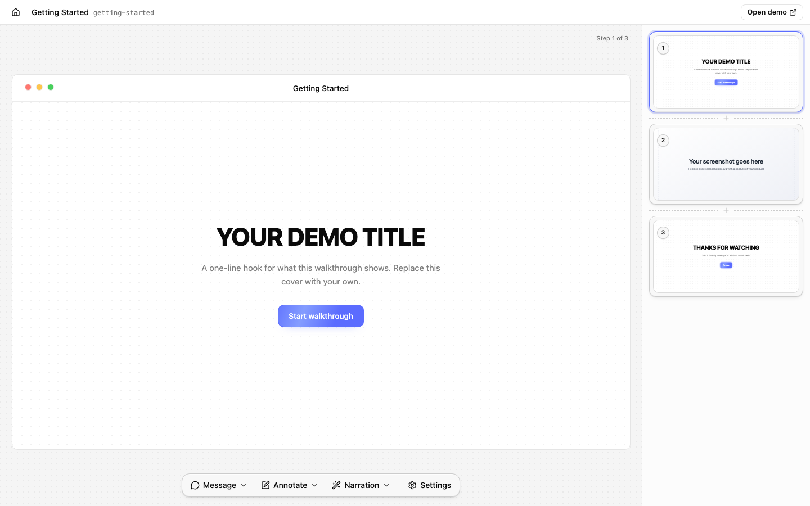

# interactive-demo

Open-source interactive product demos. Capture screenshots or a short screen
recording of your product, add hotspots and captions in a local editor, and
build a static demo you can host anywhere and embed with an iframe.



- **No hosting on our side.** `build` writes a self-contained folder per demo.
  Put it on any static host.
- **A player you can also use as a React component**, if your site is React.
- **A local editor** served by the dev command. Edits are saved straight to
  the demo's files in your repo.
- **Capture from a live app**: click through your product in Chrome and every
  click becomes a step.

## Quickstart

```sh
npx @inkly-org/interactive-demo-cli init my-demos
cd my-demos && npm install
npm run dev          # http://localhost:3000 — preview, and the editor under /__demo/editor/
```

Record a demo from your product (needs Google Chrome; see [requirements](#requirements)):

```sh
npx interactive-demo capture start https://app.example.com --name "Onboarding"
# click through the product in the Chrome window that opens
npx interactive-demo capture stop     # writes demos/onboarding/
npm run dev                           # open it, then click Edit to add captions
```

Build and embed:

```sh
npm run build                         # dist/<slug>/index.html, player.js, player.css, player-fonts.css + fonts/, assets/ (+ brand/ for a local logo)
```

Deploy `dist/` (or one `dist/<slug>/` folder) to any static host and embed:

```html
<iframe
  src="https://your-site.com/demos/onboarding/"
  width="960" height="600"
  loading="lazy" allow="fullscreen"
  style="border:0; max-width:100%">
</iframe>
```

See [docs/embedding.md](docs/embedding.md) for hosting and sizing notes.

## Use the player as a React component

```sh
npm install @inkly-org/interactive-demo react react-dom
```

```tsx
import { Demo } from '@inkly-org/interactive-demo';
import '@inkly-org/interactive-demo/styles.css';
import config from './demos/onboarding/demo.config.json';

export function OnboardingDemo() {
  return <Demo config={config} />;
}
```

Assets referenced as `asset:<id>` resolve through the `assets` and
`resolveAssetUrl` props; see the [runtime README](packages/runtime/README.md).

## The static page contract

Every built page is the same five lines, so you can also assemble one yourself:

```html
<link rel="stylesheet" href="./player.css">
<script id="demo-config" type="application/json">{ …demo.config.json… }</script>
<script id="demo-assets" type="application/json">[ …assets.json → assets… ]</script>
<div id="root"></div>
<script src="./player.js"></script>
```

`player.js` bundles React and the player. `asset:<id>` references resolve to
the manifest entry's `publicUrl`, or to `./assets/<file>` next to the page.

## Requirements

- Node.js 20 or newer.
- Google Chrome (or Chromium) for `capture`. Found automatically, or pass
  `--browser`.
- `ffmpeg` on `PATH`, only for video steps during capture. Without it, every
  step is a still image.

## How it's organised

| package | npm | what it is |
|---|---|---|
| [`packages/runtime`](packages/runtime) | `@inkly-org/interactive-demo` | the React player, the demo schema and the self-contained `player.js` |
| [`packages/cli`](packages/cli) | `@inkly-org/interactive-demo-cli` | `init`, `dev`, `capture`, `validate`, `build` |
| [`packages/editor`](packages/editor) | not published | the local editor, built into the CLI and served by `dev` |

Docs:

- [Authoring demos](docs/authoring.md) — project layout, steps, hotspots,
  captions, chapters, voiceover, assets.
- [`demo.config.json` reference](docs/schema.md) — every field, generated from
  the schema.
- [Embedding](docs/embedding.md) — hosting, iframe sizing, the React route.
- [`examples/getting-started`](examples/getting-started) — a complete project
  that CI validates and builds.

## Made-with badge

The player shows a small "Made with interactive-demo" link in its corner. It is
on by default; turn it off per demo with

```json
{ "chrome": { "branding": false } }
```

## Contributing

Pull requests are welcome. Commits are signed off under the Developer
Certificate of Origin; see [CONTRIBUTING.md](CONTRIBUTING.md).

```sh
npm install
npm run build && npm run typecheck && npm run lint && npm test
```

## License

MIT. "Inkly" is a trademark of its owner and is not covered by this license.

Built by the team behind [Inkly](https://inklyai.dev), an AI demo agent.
